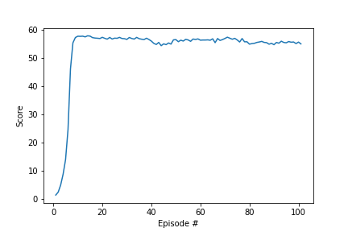

# Project 2: Continuous Control Report
---

## Learning Algorithm
  ### Env
  The Version 2 Reacher Environment with 20 agents was used for this project.
  ### DDPG
  The Algorithm used for this project is Deep Deterministic Policy Gradient (DDPG). DDPG combines ideas froms Value-based and Policy based methods. It it uses the actor value function dynamic from DQN represented as neural networks and policy gradient balancing using an critic to estimate the value of a state action in order to direct the actor's learning for direct action output. This direct action output allows for this algorithm to operate over continuous action spaces. We also use an experience replay to learn from past actions and use a soft updated target networks to enhance stablity.
  ### Networks
  Actor:
  The actor takes in a state and directly outputs an action within -1 and 1, hence tanh.
  ```
  {
        self.fc1 = F.relu(nn.Linear(state_size, fc1_units))
        self.fc2 = F.relu(nn.Linear(fc1_units, fc2_units))
        self.fc3 = torch.tanh(nn.Linear(fc2_units, action_size))
  }
  ```
  Critic:
  The critic takes the state in the first lay and then the embedded state plus the action in the second layer and outputs a single value output.
  ```
  {
        self.fcs1 = F.relu(nn.Linear(state_size, fcs1_units))
        x = torch.cat((xs, action), dim=1)
        self.fc2 = F.relu(nn.Linear(fcs1_units+action_size, fc2_units))
        self.fc3 = nn.Linear(fc2_units, 1)
  }
  ```
  ### Found Hyperparameters
  ```
  base_config = {
                'buffer_size' : int(1e6),              # The experience replay size
                'batch_size' : [128],                  # The batch size of experiences used for learning
                'gamma' : 0.95,                        # Future reward discount factor
                'tau' : 1e-3,                          # The soft-update weight 
                #'lr_actor' : 1e-3,
                #'lr_critic' : 1e-4,
                'lr_actor' : [1e-3],                   # Actor Learning Rate
                'lr_critic' : [1e-4],                  # Critic Learning Rate
                #'weight_decay' : 0.0,
                'weight_decay' : 0.000008,             # Adam optimizer critic weight decay  
                'theta' : 0.15,                        # Noise Process mu gradient weight
                'num_agents' : 20,                     # Num Agents in the environment - Evaluated in loop from env 
                'random_seed' : 15,                    # Seed 
                'train_every_ts' : [10,20],            # Every x timesteps to learn 
                'train_repeated' : [40,20,50],         # How many times to repeat a learning step
                'checkpoint_every_n_episodes': 50,     # Every x episodes to checkpoint
                'print_every' : 1,                     # Episode printout
                'training_episodes' : 500,             # How many episodes to run   
                'max_t' : 1500,                        # Max episode time step length - Horizon
                'ray_tune' : True,                     # Ray tune flag
                'train_mode' : True,                   # Runs Unity Environment in no graphics and training mode
                'average_score_over' : 100,            # Length of score queue used to evaluate success: 30  > avg(score_queue)
                'load_model' : False,                  # Used to Load a mode
                'actor_path' : './TUNE1_bz_128_lrA_0.001_lrC_0.0001_tet_10_tr_40/successful_checkpoint_actorTUNE1_bz_128_lrA_0.001_lrC_0.0001_tet_10_tr_40_100.pth',
                'critic_path' : './TUNE1_bz_128_lrA_0.001_lrC_0.0001_tet_10_tr_40/successful_checkpoint_criticTUNE1_bz_128_lrA_0.001_lrC_0.0001_tet_10_tr_40_100.pth',
                'load_scores' : False,                 # Used to load a score list
                'scores_path' : './TUNE1_bz_128_lrA_0.001_lrC_0.0001_tet_10_tr_40/successful_scoresTUNE1_bz_128_lrA_0.001_lrC_0.0001_tet_10_tr_40_100.pkl',
                'learn_flag': True                     # Whether to learn and improve current agents model         
}
  ```

## Reward Plot


Average Score Over Past 100 Episodes: 53.88106879566424
Please see saved successful_training_log.txt for training output for the successful training run.

## Important Notes
* Default OU Noise Process had mu start out as ones. Changed to zeros help stop bias in the noise.
* Training every 10 or 20 steps for 20 or 40 times gave the greatest stability for an agent's performance
* Batches sizes of 64, 128 and 256 did not show any substantial difference

## Future Work
1. Prioritized Experiment Replay
 * A prioritized experiment replay is a replay buffer that samples from the buffers based on an experiences that may provide the greatest learning benefit for the agent. This could help the agent quickly find an optimal policy over a wider hyperparameter space due to focus on high potential experiences
2. Explore other Algorithms
 * DDPG was quite difficult to tune without leading lack of performance stability. Trust Region Policy Optimization (TRPO) would be another good algorithm to explore.